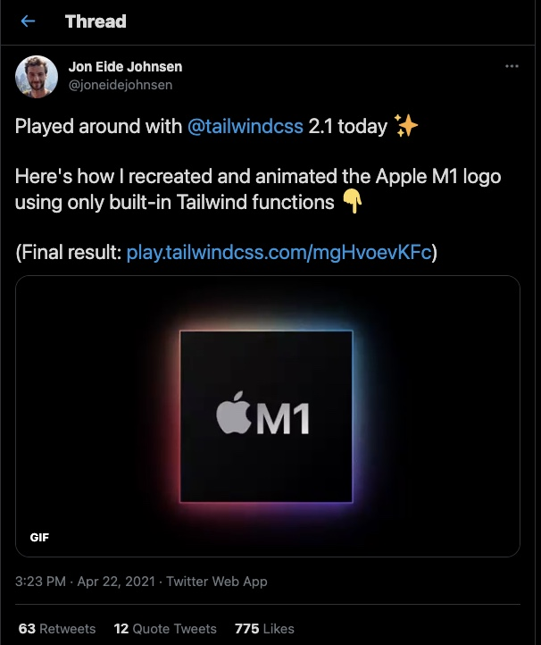

# TailwindCSS Apple M1 Chip Design

<a href="https://twitter.com/joneidejohnsen/status/1385358668116463621">
    
I saw this neat design of the Apple M1 chip on the TailwindCSS discord and wanted to utilize it for my "logo" in OG-image. I experimented with other things as well, which is why I converted the design into Next.js.

All credits go to @joneidgejohnsen


## Reproduction

First, clone the repository:

```bash
git clone https://github.com/minor/tailwindcss-nextjs-logo.git
```

Move into the correct directory:

```bash
cd tailwindcss-nextjs-logo
```

Install packages/dependencies:

```bash
npm install
# or
yarn
```

Move into the correct directory:

```bash
npm run dev
# or 
yarn dev
```

Open [http://localhost:3000](http://localhost:3000) with your browser to see the result. Start changing things around!